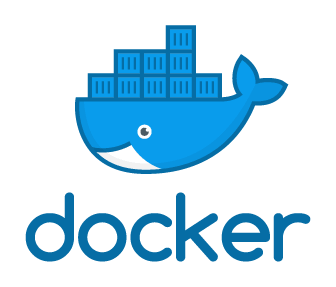

Gloo can be installed in several different ways. The most common and customization way to deploy Gloo is to 
install on Kubernetes **[using the published helm chart](install_with_helm)**. For a faster introduction, 
follow the **[open source quick start guide](quick_start)**. 

## Quick Start on Kubernetes

<table>
<tr>
<td>

</td>
<td>
To quickly get up and running with open source Gloo on Kubernetes, check out the <a href="quick_start"><b>quick start guide</b></a>. 
</td>
</tr>
</table>

## Other Ways to Deploy

There are several different ways to deploy open source Gloo. 

<table>
<tr>
<td></td>
<td></td>
<td></td>
</tr>
<tr>
<td>
Gloo was designed for production deployment to Kubernetes. The Gloo control plane and proxies can be customized 
by <a href="install_with_helm"><b>deploying using the helm chart.</b></a> 
</td>
<td>
Gloo can run on multiple variants of Kubernetes. Check out this guide if you are <a href="gke"><b>installing on a Google Kubernetes Engine (GKE) cluster.</b></a> 
</td>
<td>
Gloo can be deployed locally for testing purposes using <b><a href="docker-compose">docker compose.</a></b>  
</td>
</tr>
</table>

